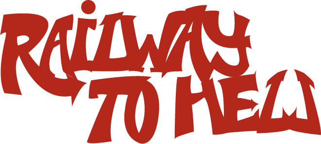
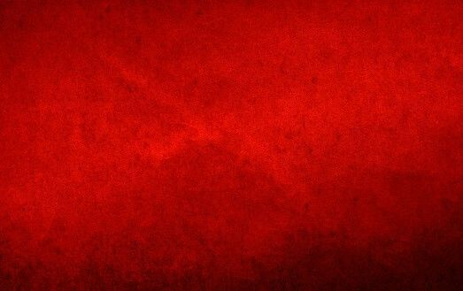

<!DOCTYPE html>
<html lang="es">
<head>
  <meta charset="UTF-8">
  <meta name="viewport" content="width=device-width, initial-scale=1.0">
  <title>Railway to Hell | A Hellish Metroidvania Adventure</title>
  <link href="https://cdn.jsdelivr.net/npm/bootstrap@5.3.3/dist/css/bootstrap.min.css" rel="stylesheet">
  <link href="https://fonts.googleapis.com/css2?family=Orbitron:wght@400;700&family=Kanit:wght@300;400;600&display=swap" rel="stylesheet">
  
</head>
<body>

  

    

      
      
Railway to Hell is a Metroidvania action and exploration video game set in a hellish version of a railway system. The player controls Nadia, a girl from a gang trapped in this hell, seeking redemption and the chance to escape with her deceased sister. Through intense melee combat, distance combat, progressive skill upgrades and exploration of the train lines, you must challenge the demonic lords who control this hellish system.

    

    

    

      <h2><i class="fas fa-film"></i> Trailer</h2>
      

        [Embed YouTube trailer here]
      

      <blockquote class="blockquote mt-4">
        "Death is not the last stop"
        <footer class="blockquote-footer">Railway to Hell</footer>
      </blockquote>
    

    

      <h2><i class="fas fa-book"></i> Narrative</h2>
      

        Nadia finds herself in a hellish railway system where demonic lords control different lines. Guided by what she believes are her sister's memories, she must battle through the system, uncovering dark truths about her past and the nature of this underworld.
      

      

        The railway lines represent different circles of hell, each with unique environments and challenges. From the industrial wasteland of Line 666 to the cathedral-like stations of the Crimson Express, each area tells part of Nadia's tragic story.
      

    

    

      <h2><i class="fas fa-bullseye"></i> Game Objective</h2>
      <ul>
        <li>Explore interconnected tunnels and stations filled with secrets</li>
        <li>Defeat demonic bosses to gain new mobility abilities</li>
        <li>Solve environmental puzzles using your growing arsenal</li>
        <li>Uncover the truth about your sister and this hellish world</li>
        <li>Upgrade your weapons and abilities to access new areas</li>
        <li>Survive the ever-changing train schedules that alter the environment</li>
      </ul>
    

    

    

      <h2><i class="fas fa-palette"></i> Art Style & Inspirations</h2>
      
Our pixel-art aesthetic combines gritty urban decay with supernatural elements, inspired by:

      <ul>
        <li>Classic Metroidvania games with modern fluid animations</li>
        <li>Underground graffiti culture and urban exploration</li>
        <li>Gothic and demonic mythology reimagined in a railway setting</li>
        <li>Barcelona's unique architecture (like Gaudí's mosaics) twisted into hellscapes</li>
        <li>Industrial decay and abandoned subway systems</li>
      </ul>
    

    

      <h2><i class="fas fa-gamepad"></i> Controls</h2>
      
      <ul class="nav nav-tabs" id="controlsTab" role="tablist">
        <li class="nav-item" role="presentation">
          <button class="nav-link active" id="controller-tab" data-bs-toggle="tab" data-bs-target="#controller" type="button" role="tab">Controller</button>
        </li>
        <li class="nav-item" role="presentation">
          <button class="nav-link" id="keyboard-tab" data-bs-toggle="tab" data-bs-target="#keyboard" type="button" role="tab">Keyboard</button>
        </li>
      </ul>
      
      

        

          

            

              <h4>Movement</h4>
              <ul>
                <li><code>Left Stick</code>: Move</li>
                <li><code>X / A</code>: Jump</li>
                <li><code>R1 / RB</code>: Dash</li>
              </ul>
            

            

              <h4>Combat</h4>
              <ul>
                <li><code>Square / X</code>: Melee Attack</li>
                <li><code>R2 / RT</code>: Use whip</li>
                <li><code>L2 / LT</code>: Throw Balls</li>
              </ul>
            

          

          

            

              <h4>Interaction</h4>
              <ul>
                <li><code>Circle / B</code>: Use Key (Doors/Interactions)</li>
                <li><code>Circle / B</code>: Close dialogues</li>
                <li><code>Circle / B</code>: Use checkpoints</li>
              </ul>
            

            

              <h4>System</h4>
              <ul>
                <li><code>Triangle / Y</code>: Map</li>
                <li><code>Options / Menu</code>: Pause</li>
              </ul>
            

          

        

        
        

          

            

              <h4>Movement</h4>
              <ul>
                <li><code>A/D</code>: Move Left/Right</li>
                <li><code>SPACE</code>: Jump</li>
                <li><code>SHIFT</code>: Dash</li>
              </ul>
            

            

              <h4>Combat</h4>
              <ul>
                <li><code>J</code>: Melee Attack</li>
                <li><code>K</code>: Use whip</li>
                <li><code>L</code>: Throw Balls</li>
              </ul>
            

          

          

            

              <h4>Interaction</h4>
              <ul>
                <li><code>E</code>: Use Key (Doors/Interactions)</li>
                <li><code>E</code>: Close dialogues</li>
                <li><code>E</code>: Use checkpoints</li>
              </ul>
            

            

              <h4>System</h4>
              <ul>
                <li><code>M</code>: Map</li>
                <li><code>ESC</code>: Pause</li>
              </ul>
            

          

        

      

    

    

    

      <h2><i class="fas fa-users"></i> Development Team</h2>
      

        

          <h5>Sanchez Carraro Felipe</h5>
          
Lead Programmer

        

        

          <h5>Sanjose Aragon Pablo</h5>
          
Game Designer

        

        

          <h5>Sarrias Basurte Martina</h5>
          
Art Director

        

        

          <h5>Vida Bosch Javier</h5>
          
Level Designer

        

      

    

    

      <h2><i class="fas fa-images"></i> Gallery</h2>
      

        

          
        

        

          
        

        

          
        

        

          
        

        

          
        

      

    

    

      <h2><i class="fas fa-link"></i> Links</h2>
      

        <a href="#" class="btn btn-outline-danger">Steam Page</a>
        <a href="#" class="btn btn-outline-warning">Press Kit</a>
        <a href="#" class="btn btn-outline-info">Developer Blog</a>
        <a href="#" class="btn btn-outline-secondary">Support</a>
      

    

    <footer class="flicker">
      
© 2025 Railway to Hell. All rights reserved. | "Death is not the last stop"

    </footer>
  

  
  
</body>
</html>